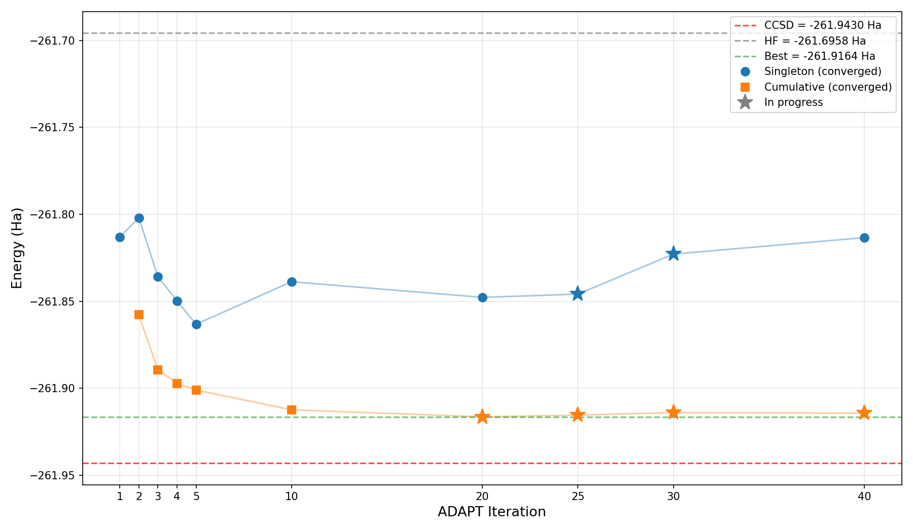
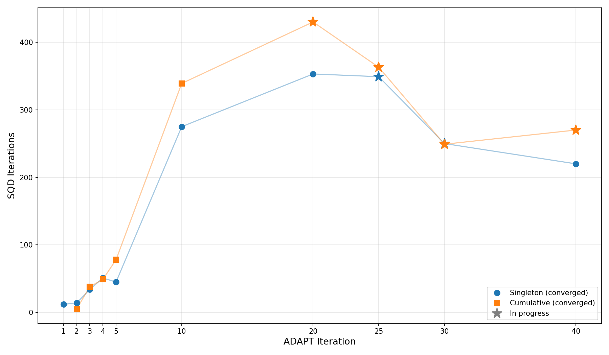

# SBD-SQD: GPU-Accelerated Sample-based Quantum Diagonalization

This is a fork of [r-ccs-cms/sbd](https://github.com/r-ccs-cms/sbd) (Selected Basis Diagonalization), a GPU-accelerated Davidson eigensolver for quantum chemistry developed by Tomonori Shirakawa (RIKEN) and IBM collaborators. We extend it for use as the diagonalization backend in the [Sample-based Quantum Diagonalization (SQD)](https://arxiv.org/abs/2405.05068) algorithm, replacing PySCF's CPU-based Selected CI solver.

## Changes from upstream

Minimal modifications to the C++ code (3 files changed):

- **`apps/.../main.cc`**: Added separate spin-resolved density output (`density_alpha`, `density_beta`) needed by SQD's configuration recovery step. Fixed missing bracket in density output formatting.
- **`include/.../davidson.h`**: Removed debug print statement from Davidson iteration loop.
- **`apps/.../Configuration`**: Build configuration for MSU ICER (NVHPC + CUDA + FlexiBLAS).

Added files:

- **`run_sqd.py`**: Python SQD loop that calls SBD for diagonalization. Handles bitstring loading, configuration recovery, subsampling, and convergence checking with checkpoint/resume support.
- **`submit_sqd.sh`**: Example SLURM batch script for MSU ICER.

## Requirements

**C++ (SBD solver):**
- NVHPC compiler with CUDA support (tested with NVHPC 23.7, CUDA 12.1)
- MPI (OpenMPI)
- LAPACK/BLAS (FlexiBLAS or OpenBLAS)
- NVIDIA GPU (A100 or H200)

**Python (SQD loop):**
- numpy
- pyscf
- qiskit-addon-sqd
- matplotlib

## Building

```bash
# On MSU ICER:
module load NVHPC/23.7-CUDA-12.1.1
module load OpenMPI/4.1.5-NVHPC-23.7-CUDA-12.1.1
module load FlexiBLAS/3.3.1-NVHPC-23.7-CUDA-12.1.1

cd apps/chemistry_tpb_selected_basis_diagonalization

# Edit Configuration to set -gpu=cc80 (A100) or -gpu=cc90 (H200)
make
```

This produces the `diag` executable.

## Running

The SQD loop takes quantum measurement data (bitstring counts from IBM hardware) and iteratively refines the ground state energy estimate.

```bash
python run_sqd.py \
    --circuit_dir /path/to/circuits \
    --hamiltonian_dir /path/to/hamiltonians \
    --results_dir /path/to/results \
    --sbd_exe ./apps/chemistry_tpb_selected_basis_diagonalization/diag \
    --output_dir ./output \
    --max_iterations 2000 \
    --resume \
    1 2 3 4 5    # ADAPT iteration indices to include
```

The positional arguments are ADAPT-VQE iteration indices. A single index runs a "singleton" experiment; multiple indices pool the measurement data ("cumulative").

### SLURM submission

```bash
sbatch submit_sqd.sh
```

This runs singletons for ADAPT 1, 2, 3 and cumulatives [1,2], [1,2,3] as a job array.

## Results

Energy convergence for the ATP fragment (`atp_0_be2_f4`, 32 orbitals, 32 electrons) using 100k-shot measurements from IBM Boston:





## Upstream references

This fork is based on:

- **SBD library**: Tomonori Shirakawa, RIKEN Center for Computational Science — https://github.com/r-ccs-cms/sbd
  - Paper: [Closed-loop calculations of electronic structure on a quantum processor and a classical supercomputer at full scale](https://arxiv.org/abs/2511.00224)
  - GPU implementation: [GPU-Accelerated Selected Basis Diagonalization with Thrust for SQD-based Algorithms](https://arxiv.org/abs/2601.16637)
- **SQD algorithm**: J. Robledo-Moreno et al., [Chemistry Beyond Exact Solutions on a Quantum-Centric Supercomputer](https://arxiv.org/abs/2405.05068)

## Licence

[Apache License 2.0](https://github.com/r-ccs-cms/sbd/blob/main/LICENSE.txt)
